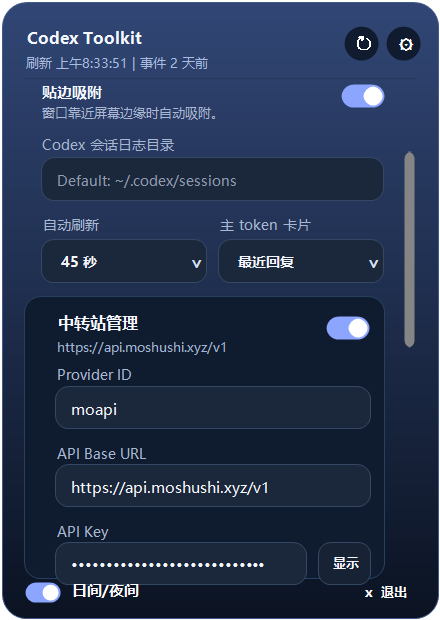
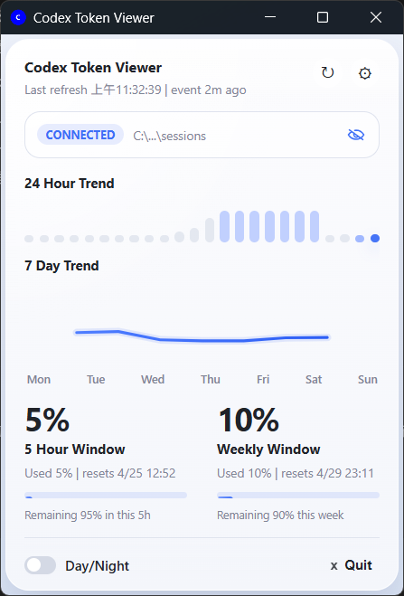
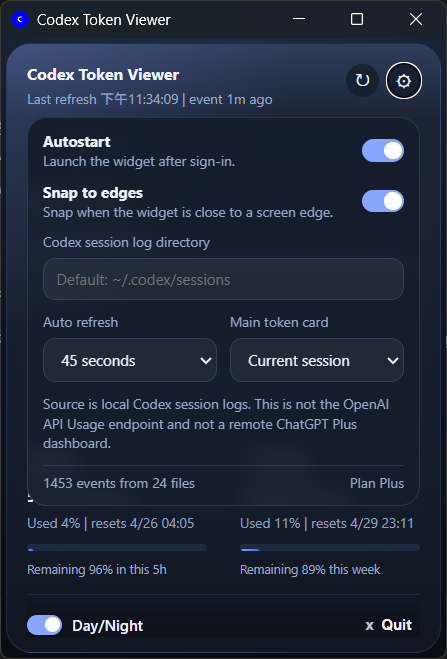
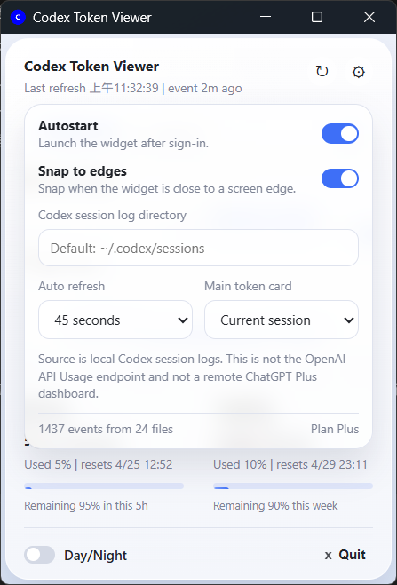

# Codex Toolkit

<p align="center">
  <strong>A local-first desktop toolkit for Codex usage monitoring and relay provider management.</strong>
</p>

<p align="center">
  
</p>

<p align="center">
  <a href="#quick-start">Quick Start</a> ·
  <a href="#features">Features</a> ·
  <a href="#relay-management">Relay Management</a> ·
  <a href="#development">Development</a>
</p>

Codex Toolkit reads local Codex session logs and turns token activity into a compact desktop dashboard. It also manages Codex relay/API configuration, so you can switch between the official route and a relay endpoint without hand-editing `~/.codex/config.toml`.

Current release targets: Windows and macOS.

## Screenshots

<p>
  
  
  
  
</p>

## Quick Start

```bash
npm install
npm run dev
```

Build desktop installers:

```bash
npm run build
```

Build outputs are generated under:

- `src-tauri/target/release/bundle/msi`
- `src-tauri/target/release/bundle/nsis`
- `src-tauri/target/release/bundle/dmg`
- `src-tauri/target/release/bundle/macos`

## Features

| Area | What you get |
| --- | --- |
| Token dashboard | Current session totals, last response usage, trend views, context window size |
| Rate-limit view | 5-hour and weekly usage windows based on local Codex session logs |
| Relay management | Provider ID, API Base URL, API Key, apply, restore official, apply and restart |
| Desktop behavior | Tray minimize/restore, login autostart, edge snapping, privacy mode |
| UI | English/Chinese menu switching and day/night theme toggle |

## Relay Management

Codex Toolkit stores relay settings locally, then writes them to Codex only when you apply the configuration.

With the default Provider ID `moapi`, the generated Codex config looks like:

```toml
model_provider = "moapi"

[model_providers.moapi]
name = "moapi"
wire_api = "responses"
requires_openai_auth = true
base_url = "https://your-relay.example.com/v1"
experimental_bearer_token = "sk-..."
```

The Provider ID is editable. If you set it to `myrelay`, Codex Toolkit writes:

```toml
model_provider = "myrelay"

[model_providers.myrelay]
name = "myrelay"
wire_api = "responses"
requires_openai_auth = true
base_url = "https://your-relay.example.com/v1"
experimental_bearer_token = "sk-..."
```

Before writing, the existing Codex config is backed up as:

```text
config.toml.codexviewer-backup-YYYYMMDD-HHMMSS
```

Restore official removes the active toolkit-managed provider, the default `moapi` provider, and the legacy `CodexViewerRelay` provider if present.

## How Data Loading Works

The app:

1. Resolves the Codex sessions directory
2. Recursively scans `.jsonl` files
3. Extracts `token_count` events
4. Reads the current toolkit-managed Codex provider status
5. Builds the latest token snapshot and trend series
6. Labels usage as official or relay-backed
7. Renders the result in the desktop UI

Default log location:

```text
~/.codex/sessions
```

You can override the log directory from the settings panel.

## Why It Exists

OpenAI's public API usage endpoints are designed for organization billing and API usage, not local Codex desktop session analytics. Relay providers also differ in how they expose usage data.

Codex Toolkit focuses on local Codex usage reconstruction by reading session log files already available on your machine, then labels that usage according to your current Codex route: official or relay.

## Development

Requirements:

- Node.js 20+
- Rust toolchain with `cargo`
- Windows: Microsoft Visual Studio C++ Build Tools
- macOS: Xcode Command Line Tools

Useful checks:

```bash
cargo test --manifest-path src-tauri/Cargo.toml
npm run build
```

Frontend syntax-only check on Windows:

```powershell
$tmp = Join-Path $env:TEMP 'codex-toolkit-renderer-check.mjs'
Copy-Item src\renderer.js $tmp -Force
node --check $tmp
```

## Release Automation

This repository includes two GitHub Actions workflows:

- `CI`: runs tests and verifies the app builds on pushes and pull requests
- `Release`: builds Windows and macOS bundles and uploads them to GitHub Releases when you push a version tag like `v1.0.0`

Example release flow:

```bash
git tag v1.0.0
git push origin main
git push origin v1.0.0
```

## Platform Notes

- Windows release artifacts are generated as `.msi` and `setup.exe`
- The Windows release executable uses the GUI subsystem, so it does not open a console window
- macOS release artifacts are generated as `.dmg` and `.app`
- macOS signing and notarization are not configured yet, so Gatekeeper warnings may still appear on first launch

## Privacy

Codex Toolkit reads local session logs from your machine. It does not call the public OpenAI organization usage API to populate the dashboard.

API keys are stored locally in the toolkit settings file and written to Codex config only when you apply relay settings. Avoid sharing screenshots that reveal full local paths or sensitive relay details; use the built-in privacy toggle when needed.

## Contributing

Please read [CONTRIBUTING.md](./CONTRIBUTING.md) before opening a pull request.

## License

[MIT](./LICENSE)
